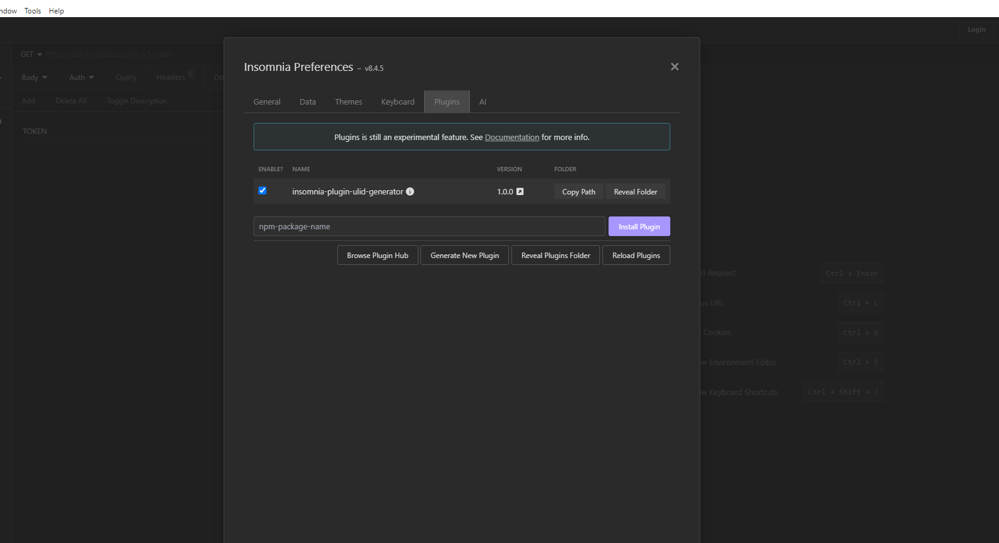
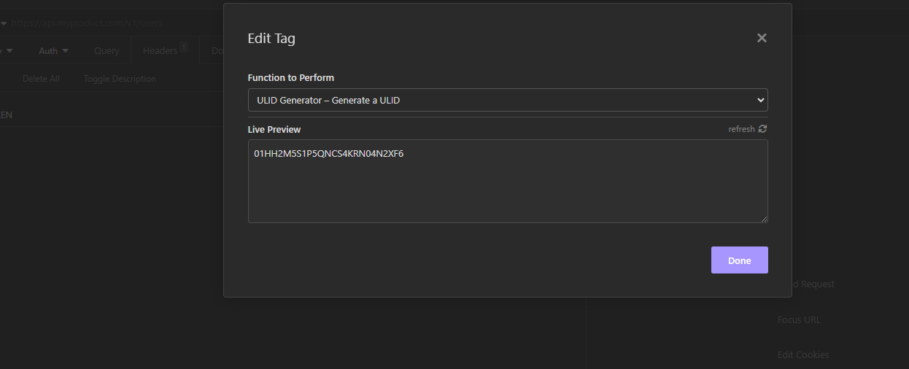

<h1 align="center">
	
</h1>

<h1 align="center">Insomnia ULID Generator Plugin</h1>

  
  
  
  

<h6>Support me</h6>

  

This plugin for Insomnia provides a ULID (Universally Unique Lexicographically Sortable Identifier) generator, enabling users to generate ULIDs for use in API testing and development within the Insomnia REST Client.

Refer to the [ULID spec](https://github.com/ulid/spec) for a more detailed ULID specification.

## Installation

To install the plugin:

1. Open Insomnia.
2. Navigate to "Preferences" > "Plugins".
3. Enter `insomnia-plugin-ulid-generator` in the plugin name field.
4. Click "Install Plugin".

## How to Use

After installing the plugin:

1. Create or open an existing request in Insomnia.
2. In the request editor, add the `ULID` tag where needed (e.g., in the URL, query parameters, headers, or request body).
3. The `ULID` tag will automatically be replaced with a generated ULID upon sending the request.

## License

This Insomnia plugin is distributed under the Apache License. [See LICENSE](LICENSE.md) for details.